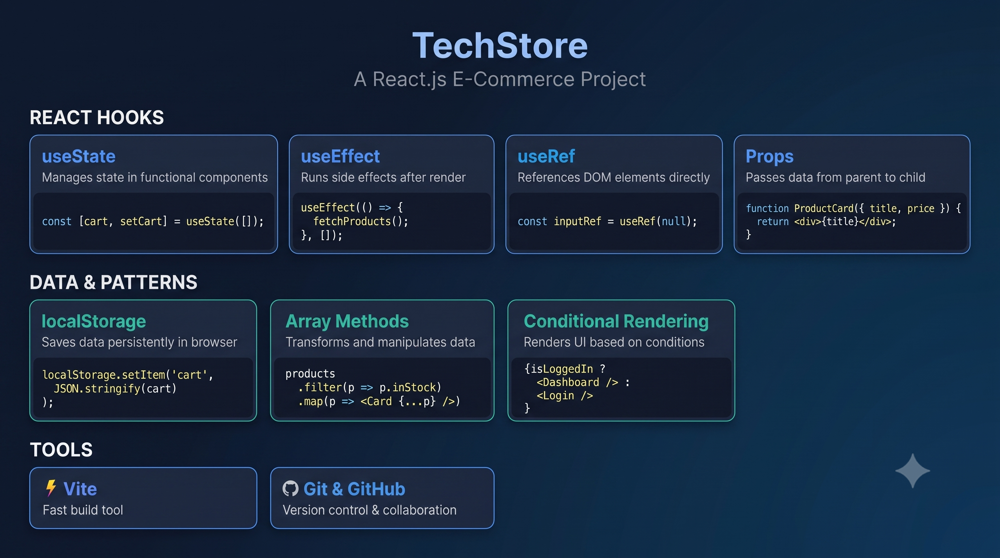
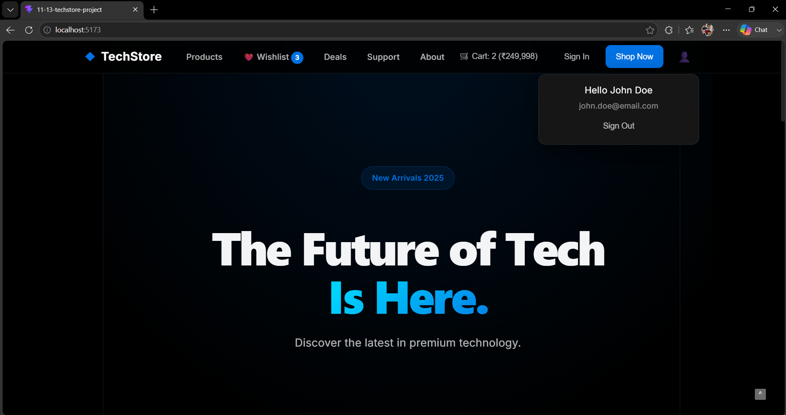
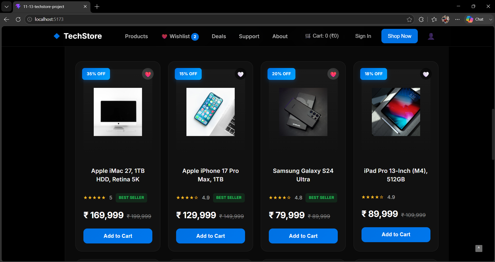
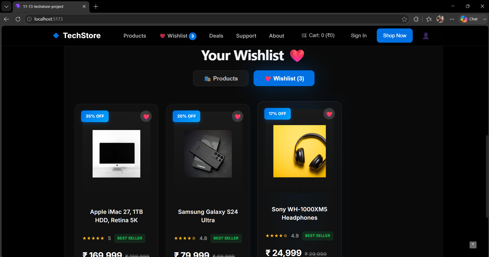
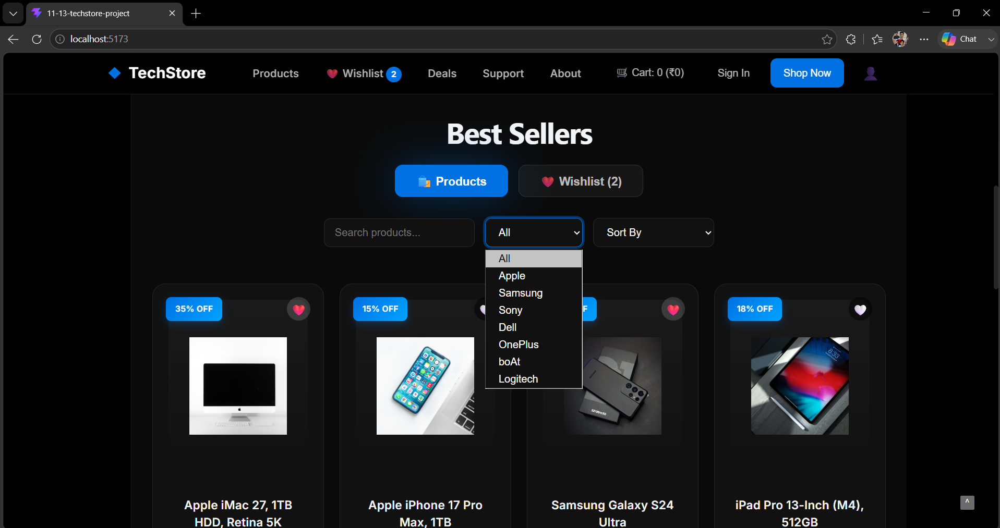

# 🛒 TechStore

A modern, fully responsive e-commerce web application built with React.js.

## ✨ Features

- 🛍️ Product browsing with search, filter & sort
- 🛒 Shopping cart with quantity management
- ❤️ Wishlist with real-time count
- 💾 Persistent data with localStorage
- 🎨 Premium dark theme UI
- 📱 Fully responsive design

---

## 📸 Screenshots

### 🏠 Hero Section

### 🛍️ Product Grid

### ❤️ Wishlist Page

### 🔍 Filter & Sort

---

## 🛠️ Tech Stack

- **React.js** — UI library with Hooks
- **CSS3** — Custom styling with dark theme
- **localStorage** — Persistent data storage
- **Vite** — Build tool
- **Git & GitHub** — Version control

---

## 🚀 Live Demo

[View Live Demo](https://your-demo-link.vercel.app)

---

## 📦 Installation

\`\`\`bash
# Clone the repository
git clone https://github.com/Harshavardhan3535/TechStore.Project.git
cd TechStore.Project

# Install dependencies
npm install

# Start development server
npm run dev
\`\`\`